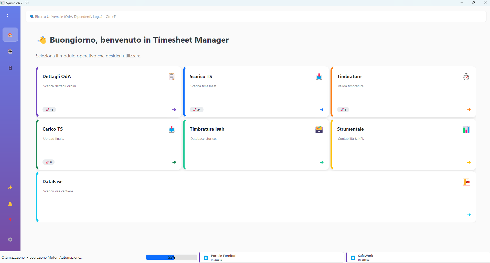

# 🚀 SyncroJob Enterprise

**Piattaforma Integrata di Automazione e Gestione per Portale ISAB**

SyncroJob è una suite software avanzata progettata per automatizzare, monitorare e ottimizzare i flussi di lavoro aziendali sul portale fornitori ISAB e SafeWork.



## 🌟 Nuove Funzionalità (v2.0+)

### 🧠 Intelligenza Artificiale & Automazione
*   **Lyra Sentinel AI**: Monitoraggio proattivo delle anomalie nei dati e nei processi.
*   **SafeWork Bot**: Automazione completa per la ricerca e l'esportazione PDL.
*   **DataEase Sync**: Sincronizzazione intelligente dei dati di cantiere.

### 🛡️ Sicurezza & Affidabilità
*   **Audit Trail Certificato**: Registro immutabile di tutte le operazioni critiche.
*   **Auto-Backup Cloud**: Salvataggio automatico e ripristino granulare dei dati.
*   **Integrità Dati**: Validazione checksum in tempo reale.

### 🎨 Command Center (Nuova UI)
*   **Dashboard Modulare**: Accesso rapido a tutti i sottosistemi da un'unica vista.
*   **Design Moderno**: Interfaccia responsiva con icone vettoriali e temi adattivi.
*   **Notifiche Smart**: Centro notifiche unificato con filtri per priorità.

---

## 🤖 Moduli Operativi

| Modulo | Descrizione | Stato |
|--------|-------------|-------|
| **📥 Scarico TS** | Download massivo timesheet (PDF/Excel) per commessa/periodo. | ✅ Attivo |
| **📋 Dettagli OdA** | Analisi dettagliata Ordini di Acquisto e stati avanzamento. | ✅ Attivo |
| **⏱️ Timbrature** | Gestione, validazione e storicizzazione timbrature dipendenti. | ✅ Attivo |
| **🏗️ SafeWork** | Integrazione completa con il portale sicurezza (PDL/Permessi). | ✅ Attivo |
| **📤 Carico TS** | Upload automatizzato dei timesheet validati. | ✅ Attivo |

---

## 📦 Installazione e Requisiti

### Requisiti di Sistema
*   **OS**: Windows 10/11 (64-bit)
*   **Browser**: Google Chrome (Ultima versione)
*   **Rete**: Connessione internet attiva (per Portali e Licenza)

### Installazione Utente
1.  Scarica l'ultimo installer da **[syncrojob.netlify.app](https://syncrojob.netlify.app)**.
2.  Esegui `SyncroJob_Setup_vX.X.X.exe`.
3.  Al primo avvio, il sistema configurerà automaticamente l'ambiente.

---

## 🛠️ Sviluppo

### Setup Ambiente
```bash
# Clone repository
git clone https://github.com/gianky00/bot-ts.git
cd bot-ts

# Installazione dipendenze (Poetry consigliato)
poetry install
# Oppure via pip
pip install -r requirements.txt
```

### Comandi Utili
*   **Avvio App**: `python main.py`
*   **Test Suite**: `pytest tests/`
*   **Linting**: `ruff check .`
*   **Type Check**: `mypy .`
*   **Build Release**: `python "admin/Crea Setup/build_dist.py"`

---

## 🔑 Licenza e Supporto

Software proprietario sviluppato da **Giancarlo Allegretti**.
L'uso è consentito solo tramite licenza attiva validata su hardware specifico.

*   **Supporto Tecnico**: Integrato nell'app (Tab Help) o via Telegram.
*   **Documentazione**: Vedi cartella `docs/`.