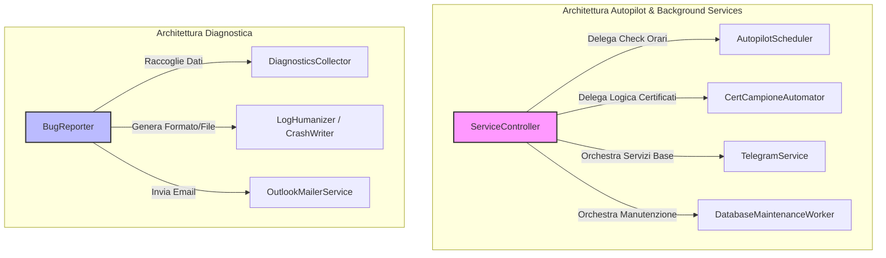

# Piano di Sviluppo Globale - Refactoring SRP (Single Responsibility Principle)

Questo piano definisce la strategia sistematica per l'eliminazione del debito tecnico SRP all'interno del codebase di **ISAB_TimeSheet**, con l'obiettivo di massimizzare la coesione strutturale, agevolare la manutenzione futura da parte di sviluppatori umani e agenti IA, ed eliminare falsi positivi o nodi architetturali complessi ("God Objects").

---

## 🚨 Diagnosi e Violazioni Rilevate

L'analisi quantitativa basata sul calcolo della metrica **LCOM (Lack of Cohesion in Methods)** e l'ispezione manuale delle dipendenze architetturali hanno evidenziato due grandi aree di violazione del principio **Single Responsibility Principle (SRP)**:

### 1. Il God Object: `ServiceController` (`src/gui/controllers/service_controller.py`)
Attualmente, questa classe si fa carico di three macro-responsabilità logiche e temporali del tutto slegate:
1. **Background Service Orchestration**: Gestisce l'avvio, l'arresto e il monitoraggio di servizi strutturali (connessione a `TelegramService`, manutenzione periodica del database SQLite, telemetry ed invio automatico dei crash log, esecuzione di `check_for_updates`).
2. **Autopilot Scheduling Engine**: Esegue un timer orologio a 60 secondi che valuta a intervalli prestabiliti l'ora locale rispetto a quanto impostato nella UI per schedulare ed accodare asincronamente i vari bot di automazione (`ScaricaTSBot`, `SafeWorkPDLSearchBot`, ecc.) e l'invio dei report e-mail.
3. **Certificati Campione Automation Service**: Gestisce l'intera pipeline aziendale dei certificati di calibrazione (lancio del `ContabilitaWorker` per l'aggiornamento dei dati a livello DB, elaborazione e analisi delle scadenze e generazione automatica di bozze e-mail Outlook tramite interfacce ibride GUI/Worker).

### 2. Componente Diagnostico: `BugReporter` (`src/core/bug_reporter.py`)
La classe gestisce in un unico punto:
1. Cattura e formattazione delle eccezioni a runtime (inclusa la scrittura di crash logs su file).
2. Raccolta di telemetria di sistema e hardware (processi attivi, allocazione memoria, path e variabili d'ambiente).
3. Invio e-mail diagnostico asincrono diretto tramite integrazione nativa Outlook MAPI.

---

## 📐 Proposta Architetturale SRP (Scomposizione)

Per sistemare in maniera definitiva e pulita queste violazioni, si propone il seguente modello di scomposizione in classi altamente coese, disaccoppiate e testabili singolarmente:

---

## 📝 Modifiche Proposte nel Dettaglio

### Componente 1: Autopilot & Background Services

---

#### [NEW] [scheduler.py](file:///c:/Users/gianc/Desktop/SCRIPT/ISAB_TimeSheet/src/core/autopilot/scheduler.py)
Creazione della classe pura `AutopilotScheduler(QObject)` deputata unicamente al monitoraggio orario dei task:
*   Mantiene il timer a 60 secondi e la configurazione dei bot pianificati (timbrature, ODA, PDL).
*   Verifica il match orario orologio rispetto alla configurazione locale dell'applicazione.
*   Invia segnali di notifica per l'avvio asincrono dei bot delegando l'accodamento effettivo.

#### [NEW] [cert_automation.py](file:///c:/Users/gianc/Desktop/SCRIPT/ISAB_TimeSheet/src/core/autopilot/cert_automation.py)
Creazione della classe di business `CertCampioneAutomator` per gestire la logica dei certificati campioni:
*   Controlla la temporizzazione a giorni impostata dall'utente.
*   Inizializza `ContabilitaWorker` per sincronizzare il DB con il file Excel delle scadenze in background.
*   Coordina l'analisi scadenze e la generazione della bozza e-mail Outlook (disaccoppiando l'accesso diretto alla UI e fornendo un fallback asincrono pulito).

#### [MODIFY] [service_controller.py](file:///c:/Users/gianc/Desktop/SCRIPT/ISAB_TimeSheet/src/gui/controllers/service_controller.py)
Sfoltimento radicale del controller GUI (riduzione da 335 a circa 170 righe):
*   Rimosso il timer orologio interno e tutta la logica di schedulazione temporale (delegata ad `AutopilotScheduler`).
*   Rimossa la logica di elaborazione dei certificati campioni (delegata a `CertCampioneAutomator`).
*   Agisce come orchestratore puro: all'avvio istanzia ed avvia i vari servizi specializzati di background e ne sincronizza i segnali con la `MainWindow` in modo thread-safe.

---

### Componente 2: Diagnostica e Gestione Errori

---

#### [NEW] [diagnostics_collector.py](file:///c:/Users/gianc/Desktop/SCRIPT/ISAB_TimeSheet/src/core/diagnostics/diagnostics_collector.py)
Classe dedita alla raccolta di telemetria e dati diagnostici:
*   Interroga il sistema operativo (RAM, CPU, partizioni).
*   Verifica lo stato dei processi bot residui (psutil).
*   Raccoglie i metadati dell'ambiente applicativo (versione, path locali, HWID).

#### [MODIFY] [bug_reporter.py](file:///c:/Users/gianc/Desktop/SCRIPT/ISAB_TimeSheet/src/core/bug_reporter.py)
*   Semplificata per occuparsi unicamente dell'intercettazione degli errori globali a runtime e del salvataggio dei file di crash (come `crash.txt`).
*   Delega la raccolta telemetria a `DiagnosticsCollector` eliminando i metodi duplicati e preservando unicamente un'interfaccia privata `_collect_system_info` per retrocompatibilità.

---

## 🏁 Stato di Attuazione e Completamento (22 Maggio 2026)

Tutte le fasi previste da questo piano di sviluppo sono state completate con successo ed integrate a livello di repository sul branch `feature/gui-optimization`.

### Esito delle Open Questions & Decisioni di Design
1. **Visualizzazione degli Alert a schermo**: È stata implementata l'integrazione asincrona e thread-safe con `NotificationManager` e `TelegramService`. Qualsiasi anomalia o successo viene inoltrato in background tramite Telegram e notifiche Toast a scomparsa (evitando dialog bloccanti che interromperebbero l'operatività in modalità Autopilot).
2. **Fallback Outlook in Autopilot**: È stata implementata una logica ibrida intelligente in `CertCampioneAutomator`. Se la UI principale e il widget `certificati_widget` sono accessibili, si delega ad essi la logica completa con screenshot e PDF. In caso contrario (es. PC bloccato o assenza di sessione attiva), viene avviato in background il worker asincrono `AutopilotCertWorker` per agganciare le API asincrone in modo trasparente.

### Risultati dei Controlli Qualitativi & Validazione
* **Ruff Linter**: Zero errori (`All checks passed!`).
* **MyPy Strict Type Checking**: Zero anomalie su tutti i sorgenti modificati (`Success: no issues found in 5 source files`).
* **Test Unitari Mirati**: `9 passed` totali con successo in totale isolamento (senza regressioni su `BugReporter` o altri moduli).
* **Commit e Versionamento**: Committato su branch locale superando tutti i pre-commit hook integrati.
