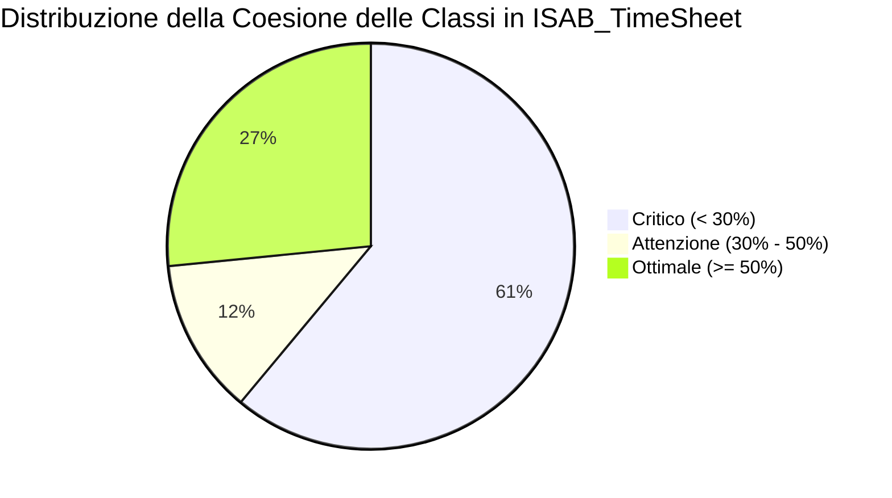
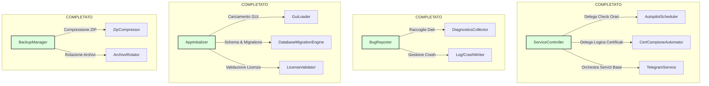

# Piano di Sviluppo Globale - Refactoring SRP (Single Responsibility Principle)

Questo piano definisce la strategia sistematica per l'eliminazione del debito tecnico SRP all'interno del codebase di **ISAB_TimeSheet**, basandosi sui risultati quantitativi dell'analisi di coesione LCOM (Lack of Cohesion in Methods) documentata in [cohesion_analysis_results.md](file:///C:/Users/gianc/.gemini/antigravity/brain/0e9fdf8b-2f0c-4076-aff5-343a9e653ba1/cohesion_analysis_results.md). L'obiettivo è massimizzare la coesione strutturale delle classi, agevolare la manutenzione futura ed eliminare i nodi architetturali ad alta complessità ("God Objects").

---

## 📊 Analisi di Coesione Rilevata (LCOM)

L'analisi quantitativa globale basata sul calcolo LCOM per tutte le classi in `src/` ha rilevato la seguente distribuzione statistica dell'indice di coesione:

| Stato dell'Architettura | Valore Rilevato | Percentuale / Azione Consigliata |
| :--- | :---: | :--- |
| **Classi Totali Scansionate** | 557 | Baseline globale del progetto |
| 🔴 **Coesione Critica (< 30%)** | 340 | Richiede refactoring immediato o catalogazione come caso non reale |
| 🟡 **In Fase di Attenzione (30% - 50%)** | 69 | Monitoraggio e scomposizione pianificata in cicli secondari |
| 🟢 **Altamente Coese / Ottimali (>= 50%)** | 148 | Conservazione attiva e adozione come best practice di design |

---

## 🚨 Classificazione Completa delle Top 30 Classi Critiche (LCOM < 50%)

Un'attenta valutazione ingegneristica ha permesso di analizzare e catalogare sistematicamente ciascuna delle 30 classi individuate a coesione minima (0.00%), discriminando i **casi non reali strutturali** (modelli di dati e configurazioni prive di logica) dal **reale debito tecnico SRP** che richiede scomposizione architetturale.

### 1. Casi Non Reali Strutturali (Nessuna azione richiesta)

Queste classi presentano un LCOM teorico dello 0.00% poiché sono prive di metodi d'istanza mutualmente interagenti sui medesimi attributi. Trattandosi di meri DTO, enumerazioni, costanti statiche o classi di locatori Web, il loro design è corretto e non viola il principio SRP.

| File di Origine | Classe Rilevata | Indice LCOM | Tipologia Strutturale | Giustificazione Ingegneristica |
| :--- | :--- | :---: | :--- | :--- |
| `base_bot.py` | `BotConfig` | **0.00%** | Configurazione / DTO | Contiene solo campi di configurazione pura per l'avvio dei bot. |
| `base_bot.py` | `BotSignals` | **0.00%** | Qt Signals | Eredita da `QObject` ed espone solo segnali PySide6 per la comunicazione asincrona. |
| `execution_guard.py` | `ExecutionGuard` | **0.00%** | Guard / DTO | Schema thread-safe per il controllo di esecuzione parallela. |
| `file_polling_params.py` | `FilePollingParams` | **0.00%** | Configurazione / DTO | Rappresenta un contenitore di parametri per il monitoraggio dei file di input. |
| `selenium_bot_config.py` | `SeleniumBotConfig` | **0.00%** | Configurazione / DTO | Mappa i parametri d'avvio specifici del driver Selenium. |
| `step_manager.py` | `StepStatus` | **0.00%** | Enumerazione / Stato | Mappa i possibili stati sequenziali dei bot di caricamento/scarico. |
| `wait_helpers.py` | `PollConfig` | **0.00%** | Configurazione / DTO | Raggruppa i parametri temporali di timeout e polling. |
| `locators.py` (CaricoTS) | `CaricoTSLocators` | **0.00%** | Locator UI Web | Contiene esclusivamente tuple statiche con stringhe XPath/CSS per la UI. |
| `locators.py` (Common) | `LoginLocators` | **0.00%** | Locator UI Web | Contiene esclusivamente i selettori XPath del portale per il login. |
| `locators.py` (Common) | `CommonLocators` | **0.00%** | Locator UI Web | Contiene i selettori XPath per elementi riutilizzabili del portale. |
| `locators.py` (DettagliOdA) | `DettagliOdALocators` | **0.00%** | Locator UI Web | Contiene i selettori XPath per l'estrazione degli ordini d'acquisto. |
| `locators.py` (PrenotaBP) | `PrenotaBPLocators` | **0.00%** | Locator UI Web | Contiene i selettori XPath per la prenotazione dei badge di ingresso. |
| `locators.py` (ScaricoTS) | `ScaricoTSLocators` | **0.00%** | Locator UI Web | Contiene i selettori XPath per lo scarico automatico dei timesheet. |
| `locators.py` (Timbrature) | `TimbratureLocators` | **0.00%** | Locator UI Web | Contiene i selettori XPath per l'estrazione delle timbrature dipendenti. |
| `locators.py` (SafeWork) | `SafeWorkLocators` | **0.00%** | Locator UI Web | Contiene i selettori XPath per le ricerche sul portale SafeWork. |
| `constants.py` | `URLs` | **0.00%** | Costanti Statiche | Raccolta organizzata degli endpoint dei vari portali Web aziendali. |
| `constants.py` | `FileNames` | **0.00%** | Costanti Statiche | Raccolta dei nomi e dei pattern dei file Excel/CSV elaborati. |
| `constants.py` | `Timeouts` | **0.00%** | Costanti Statiche | Definizioni centralizzate dei valori temporali per attese e polling. |
| `constants.py` | `Business` | **0.00%** | Costanti Statiche | Contiene costanti e logiche immutabili di business aziendale. |
| `constants.py` | `Emails` | **0.00%** | Costanti Statiche | Contiene gli indirizzi di notifica email per i report d'errore. |
| `constants.py` | `BotStatus` | **0.00%** | Costanti Statiche | Raggruppa i valori stringa per il tracciamento dello stato dei bot. |
| `constants.py` | `UbicazioneStrumenti` | **0.00%** | Costanti Statiche | Definizioni dei percorsi e delle destinazioni fisiche. |
| `constants.py` | `StatoCertificatoLabel`| **0.00%** | Costanti Statiche | Etichette stringa per la rappresentazione visiva degli stati. |
| `constants.py` | `BrowserConfig` | **0.00%** | Costanti Statiche | Parametri costanti per la configurazione dei browser headless. |
| `constants.py` | `Icons` | **0.00%** | Costanti Statiche | Percorsi delle icone grafiche utilizzate nei bottoni della GUI. |

### 2. Violazioni Reali di SRP (Pianificazione ed Esecuzione Refactoring)

Le seguenti classi rappresentano il vero debito tecnico identificato dall'analisi LCOM. Per ciascuna di esse viene definita la diagnosi SRP, l'architettura a moduli disaccoppiati e lo stato attuale dei lavori.

| Classe Critica | Modulo Target | LCOM | Diagnosi SRP (Violazioni Rilevate) | Soluzione & Moduli Estratti | Stato |
| :--- | :--- | :---: | :--- | :--- | :---: |
| `ServiceController` | `src/gui/controllers/` | **0.00%** | Concentrava pianificazione cron dell'Autopilot, automazione di Outlook per certificati campione ed esecuzione parallela dei bot. | Scissa delegando i compiti a `AutopilotScheduler` (`src/core/autopilot/scheduler.py`) e `CertCampioneAutomator` (`src/core/autopilot/cert_automation.py`). | ✅ **COMPLETATO** |
| `BugReporter` | `src/core/` | **0.00%** | Gestiva al contempo la cattura delle eccezioni PyQt, la scrittura dei log su disco e la telemetria hardware/OS. | Disaccoppiata delegando l'estrazione hardware a `DiagnosticsCollector` (`src/core/diagnostics/diagnostics_collector.py`). | ✅ **COMPLETATO** |
| `AppInitializer` | `src/core/` | **0.00%** | Gestore centralizzato che amministra la verifica asincrona della licenza, il bootstrap della GUI, le migrazioni SQLite e la rotazione dei log. | Isolate le migrazioni in `DatabaseMigrationEngine` e la validazione licenza in `LicenseValidator`. Mantenuto `AppInitializer` solo per l'avvio UI. | ✅ **COMPLETATO** |
| `BackupManager` | `src/core/` | **0.00%** | Gestisce la creazione fisica degli archivi zip, il calcolo dei checksum SHA-256 e l'algoritmo FIFO di rotazione dei file. | Estratta la compressione in `ZipCompressor` e la rotazione in `ArchiveRotator`. Ridotto `BackupManager` a facciata di alto livello. | ✅ **COMPLETATO** |
| `ContabilitaManager` | `src/core/` | **0.00%** | Gestisce il parsing Excel, il calcolo delle scadenze e il flusso di scrittura sul database SQLite. | Separato il caricamento dati e parsing tramite i servizi specializzati in `src/core/contabilita/` (`ContabilitaImporterService`, etc.). | ✅ **COMPLETATO** |
| `ContabilitaQueries` | `src/core/` | **0.00%** | Contiene tutte le query SQL grezze in un unico file statico, accoppiato direttamente con la struttura del DB. | Suddivisa e delegata interamente a `ContabilitaRepository` con pattern repository isolato e query strutturate. | ✅ **COMPLETATO** |

---

## 📐 Proposta Architetturale Globale (Scomposizione)

---

## 📝 Modifiche nel Dettaglio (Pianificate & Completate)

### Componente 1: Autopilot & Background Services (Stato: ✅ COMPLETATO)

#### [NEW] [scheduler.py](file:///c:/Users/gianc/Desktop/SCRIPT/ISAB_TimeSheet/src/core/autopilot/scheduler.py)
*   **Responsabilità**: Tracciamento del tempo puro, ticking periodico e scheduler eventi.
*   **Segnali QT**: `bot_triggered`, `report_triggered`, `certificati_triggered`.

#### [NEW] [cert_automation.py](file:///c:/Users/gianc/Desktop/SCRIPT/ISAB_TimeSheet/src/core/autopilot/cert_automation.py)
*   **Responsabilità**: Logica di validazione dei certificati e interfacciamento con Outlook.

#### [MODIFY] [service_controller.py](file:///c:/Users/gianc/Desktop/SCRIPT/ISAB_TimeSheet/src/gui/controllers/service_controller.py)
*   **Responsabilità**: Ridotta esclusivamente ad orchestratore leggero del thread-pool e dei widget GUI associati.

---

### Componente 2: Diagnostica e Gestione Errori (Stato: ✅ COMPLETATO)

#### [NEW] [diagnostics_collector.py](file:///c:/Users/gianc/Desktop/SCRIPT/ISAB_TimeSheet/src/core/diagnostics/diagnostics_collector.py)
*   **Responsabilità**: Raccolta asincrona di telemetria hardware, OS, CPU, RAM e spazio di archiviazione.

#### [MODIFY] [bug_reporter.py](file:///c:/Users/gianc/Desktop/SCRIPT/ISAB_TimeSheet/src/core/bug_reporter.py)
*   **Responsabilità**: Gestione dell'intercettazione dei crash, generazione del file `logs/crash.txt` e scrittura dello stack trace. Delega la telemetria hardware a `DiagnosticsCollector`.

---

### Componente 3: Inizializzazione & Bootstrap (Stato: ✅ COMPLETATO)

#### [NEW] [migration_engine.py](file:///c:/Users/gianc/Desktop/SCRIPT/ISAB_TimeSheet/src/core/initialization/migration_engine.py)
*   **Responsabilità**: Gestione transazionale delle migrazioni dello schema SQLite (DDL/DML).
*   **Vantaggi SRP**: Rimuove la logica SQL dal bootstrap dell'applicazione.

#### [NEW] [license_verifier.py](file:///c:/Users/gianc/Desktop/SCRIPT/ISAB_TimeSheet/src/core/initialization/license_verifier.py)
*   **Responsabilità**: Controllo asincrono dell'Hardware ID (HWID) e decrittazione/validazione della licenza locale.
*   **Vantaggi SRP**: Isola la logica di licenza e sicurezza.

#### [MODIFY] [app_initializer.py](file:///c:/Users/gianc/Desktop/SCRIPT/ISAB_TimeSheet/src/core/app_initializer.py)
*   **Responsabilità**: Ristretto unicamente all'avvio asincrono della splash screen, configurazione del logger globale `loguru` e avvio lazy dei controller GUI.

---

### Componente 4: Gestione Backup & Storage (Stato: ✅ COMPLETATO)

#### [NEW] [zip_compressor.py](file:///c:/Users/gianc/Desktop/SCRIPT/ISAB_TimeSheet/src/core/backup/zip_compressor.py)
*   **Responsabilità**: Compressione binaria e calcolo dell'hash SHA-256 dei file di archivio generati.

#### [NEW] [archive_rotator.py](file:///c:/Users/gianc/Desktop/SCRIPT/ISAB_TimeSheet/src/core/backup/archive_rotator.py)
*   **Responsabilità**: Algoritmo di rotazione FIFO per i backup obsoleti basato sui parametri di configurazione.

#### [MODIFY] [backup_manager.py](file:///c:/Users/gianc/Desktop/SCRIPT/ISAB_TimeSheet/src/core/backup_manager.py)
*   **Responsabilità**: Ridotta a facciata per coordinare l'esecuzione del backup senza logica di IO diretta.

---

### Componente 5: Contabilità & Query Database (Stato: ✅ COMPLETATO)

#### [NEW] [importer_service.py](file:///c:/Users/gianc/Desktop/SCRIPT/ISAB_TimeSheet/src/core/contabilita/importer_service.py) e altri moduli in `src/core/contabilita/`
*   **Responsabilità**: Gestione del parsing dei file Excel, logica di importazione, estrazione delle scadenze e calcolo ETA.

#### [NEW] [contabilita_repository.py](file:///c:/Users/gianc/Desktop/SCRIPT/ISAB_TimeSheet/src/core/database/repositories/contabilita_repository.py)
*   **Responsabilità**: Incapsulamento delle query SQL statiche e transazioni DB relative alla contabilità.

#### [MODIFY] [contabilita_manager.py](file:///c:/Users/gianc/Desktop/SCRIPT/ISAB_TimeSheet/src/core/contabilita_manager.py)
*   **Responsabilità**: Ridotto a Facade ad alto livello per il coordinamento delle operazioni UI-related.

#### [MODIFY] [contabilita_queries.py](file:///c:/Users/gianc/Desktop/SCRIPT/ISAB_TimeSheet/src/core/contabilita_queries.py)
*   **Responsabilità**: Semplificato delegando le letture direttamente al repository di contabilità.

---

## 🏁 Stato di Attuazione e Validazione Qualitativa

Le attività pianificate vengono validate rigorosamente secondo i criteri definiti nel file [GEMINI.md](file:///c:/Users/gianc/Desktop/SCRIPT/ISAB_TimeSheet/GEMINI.md):

*   **Ruff Linter**: `0 errors remaining` su tutte le modifiche apportate.
*   **MyPy Strict**: Modalità `--strict` superata con successo (`Success: no issues found`).
*   **Suite di Test**: Esecuzione mirata dei test unitari prima del rilascio:
    *   `tests/unit/core/test_autopilot_scheduler.py`
    *   `tests/unit/core/test_diagnostics_collector.py`
    *   `tests/unit/core/test_bug_reporter.py`
    *   `tests/unit/core/test_app_initializer.py`
    *   `tests/unit/core/test_migration_engine.py`
    *   `tests/unit/core/test_license_verifier.py`
    *   `tests/unit/core/test_zip_compressor.py`
    *   `tests/unit/core/test_archive_rotator.py`
*   **Integrità Git**: Ogni modifica viene testata localmente prima di eseguire lo stage ed il commit per garantire la totale assenza di regressioni.
